# Mermaid Showcase

---

## 1) Flowchart (Flow) — process with decision, integrations, and observability

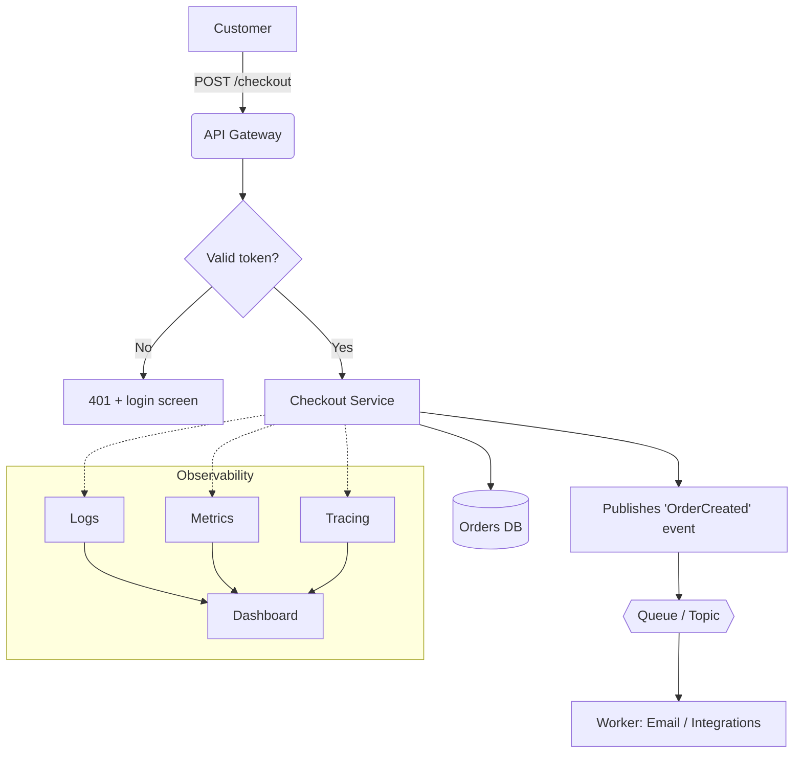
```mermaid
flowchart TD
    A[Customer] -->|POST /checkout| B(API Gateway)
    B --> C{Valid token?}
    C -- No --> D[401 + login screen]
    C -- Yes --> E[Checkout Service]
    E --> F[(Orders DB)]
    E --> G["Publishes 'OrderCreated' event"]
    G --> H{{Queue / Topic}}
    H --> I[Worker: Email / Integrations]

    subgraph Observability
        J[Logs] --> M[Dashboard]
        K[Metrics] --> M
        L[Tracing] --> M
    end

    E -.-> J
    E -.-> K
    E -.-> L
```

---

## 2) Sequence Diagram — conversation between systems (with `alt`/`opt` and activation)

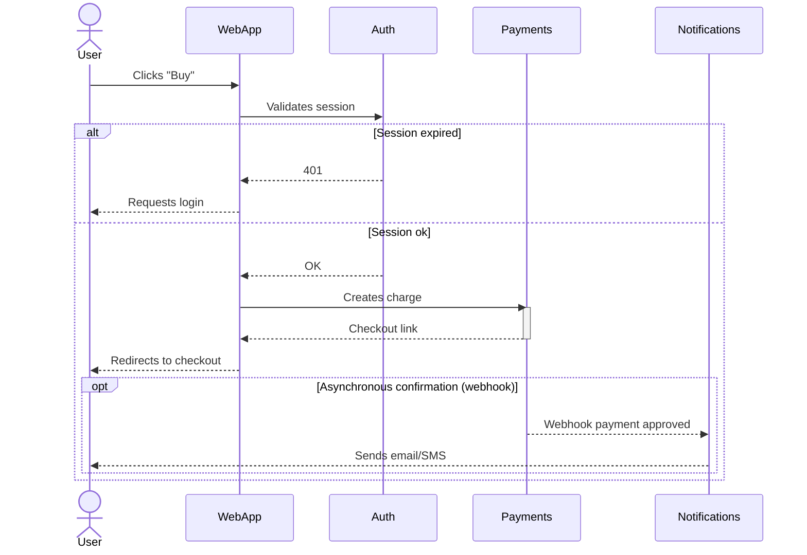
```mermaid
sequenceDiagram
    actor U as User
    participant W as WebApp
    participant A as Auth
    participant P as Payments
    participant N as Notifications

    U->>W: Clicks "Buy"
    W->>A: Validates session
    alt Session expired
        A-->>W: 401
        W-->>U: Requests login
    else Session ok
        A-->>W: OK
        W->>P: Creates charge
        activate P
        P-->>W: Checkout link
        deactivate P
        W-->>U: Redirects to checkout

        opt Asynchronous confirmation (webhook)
            P-->>N: Webhook payment approved
            N-->>U: Sends email/SMS
        end
    end
```

---

## 3) Class Diagram — OO model (inheritance + cardinalities + composition)

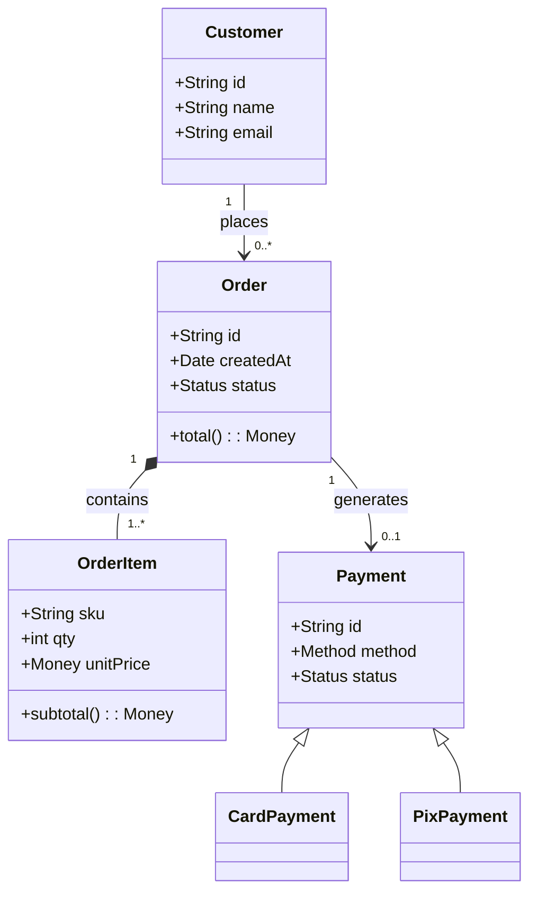
```mermaid
classDiagram
    class Order {
        +String id
        +Date createdAt
        +Status status
        +total(): Money
    }

    class OrderItem {
        +String sku
        +int qty
        +Money unitPrice
        +subtotal(): Money
    }

    class Customer {
        +String id
        +String name
        +String email
    }

    class Payment {
        +String id
        +Method method
        +Status status
    }

    class CardPayment
    class PixPayment

    Customer "1" --> "0..*" Order : places
    Order "1" *-- "1..*" OrderItem : contains
    Order "1" --> "0..1" Payment : generates
    Payment <|-- CardPayment
    Payment <|-- PixPayment
```

---

## 4) State Diagram (v2) — lifecycle (with composite substate)

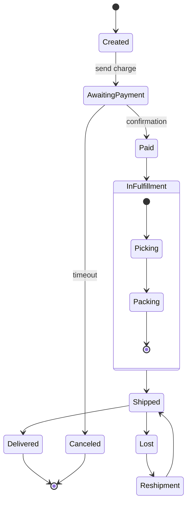
```mermaid
stateDiagram-v2
    [*] --> Created
    Created --> AwaitingPayment: send charge
    AwaitingPayment --> Paid: confirmation
    AwaitingPayment --> Canceled: timeout

    Paid --> InFulfillment
    InFulfillment --> Shipped
    Shipped --> Delivered
    Shipped --> Lost
    Lost --> Reshipment
    Reshipment --> Shipped

    Delivered --> [*]
    Canceled --> [*]

    state InFulfillment {
        [*] --> Picking
        Picking --> Packing
        Packing --> [*]
    }
```

---

## 5) ER Diagram — data schema (tables + PK/FK + cardinalities)

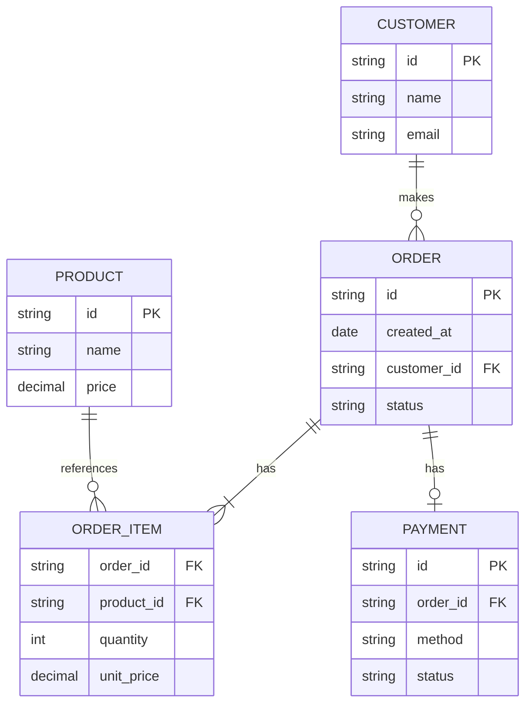
```mermaid
erDiagram
    CUSTOMER ||--o{ ORDER : makes
    ORDER ||--|{ ORDER_ITEM : has
    PRODUCT ||--o{ ORDER_ITEM : references
    ORDER ||--o| PAYMENT : has

    CUSTOMER {
        string id PK
        string name
        string email
    }

    ORDER {
        string id PK
        date created_at
        string customer_id FK
        string status
    }

    ORDER_ITEM {
        string order_id FK
        string product_id FK
        int quantity
        decimal unit_price
    }

    PRODUCT {
        string id PK
        string name
        decimal price
    }

    PAYMENT {
        string id PK
        string order_id FK
        string method
        string status
    }
```

---

## 6) Gantt — schedule (sections, dependencies, and milestones)

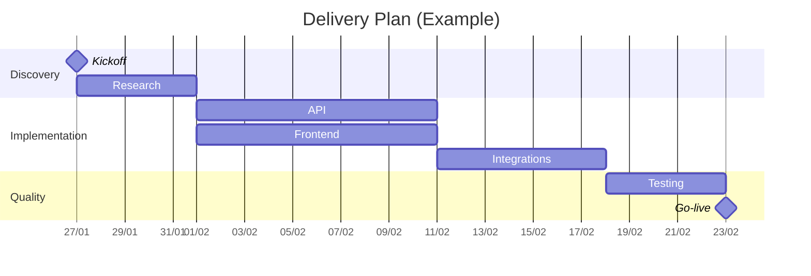
```mermaid
gantt
    title Delivery Plan (Example)
    dateFormat  YYYY-MM-DD
    axisFormat  %d/%m

    section Discovery
    Kickoff           :milestone, m1, 2026-01-27, 0d
    Research          :a1, 2026-01-27, 5d

    section Implementation
    API               :a2, after a1, 10d
    Frontend          :a3, after a1, 10d
    Integrations      :a4, after a2, 7d

    section Quality
    Testing           :a5, after a4, 5d
    Go-live           :milestone, m2, after a5, 0d
```

---

## 7) Pie Chart — quick percentage composition

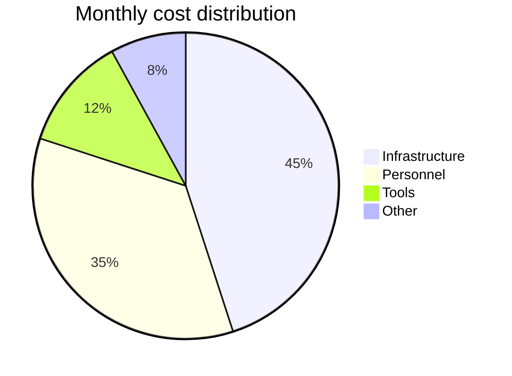
```mermaid
pie title Monthly cost distribution
    "Infrastructure" : 45
    "Personnel" : 35
    "Tools" : 12
    "Other" : 8
```

---

## 8) User Journey — journey and "pain" per step (score)

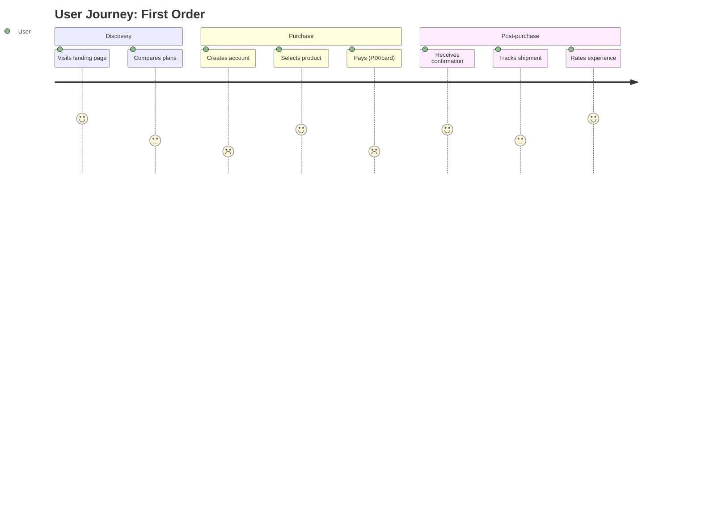
```mermaid
journey
    title User Journey: First Order
    section Discovery
      Visits landing page: 5: User
      Compares plans: 3: User
    section Purchase
      Creates account: 2: User
      Selects product: 4: User
      Pays (PIX/card): 2: User
    section Post-purchase
      Receives confirmation: 4: User
      Tracks shipment: 3: User
      Rates experience: 5: User
```

---

## 9) GitGraph — branching and merging strategy

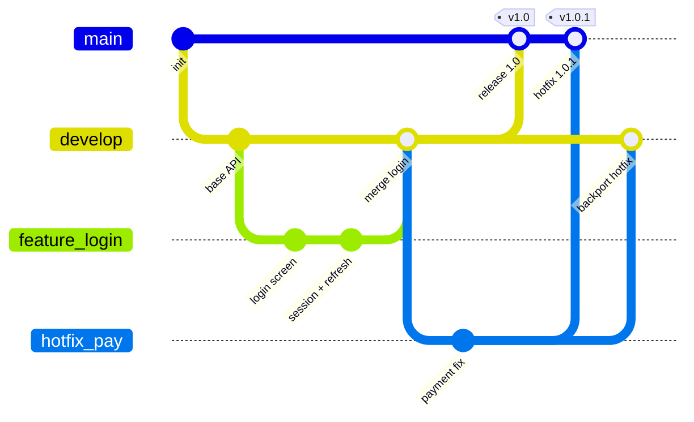
```mermaid
gitGraph
    commit id: "init"
    branch develop
    checkout develop
    commit id: "base API"

    branch feature_login
    checkout feature_login
    commit id: "login screen"
    commit id: "session + refresh"

    checkout develop
    merge feature_login id: "merge login"

    branch hotfix_pay
    checkout hotfix_pay
    commit id: "payment fix"

    checkout main
    merge develop id: "release 1.0" tag: "v1.0"
    merge hotfix_pay id: "hotfix 1.0.1" tag: "v1.0.1"

    checkout develop
    merge hotfix_pay id: "backport hotfix"
```

---

## 10) Mindmap — brainstorm/organization of ideas (hierarchy)

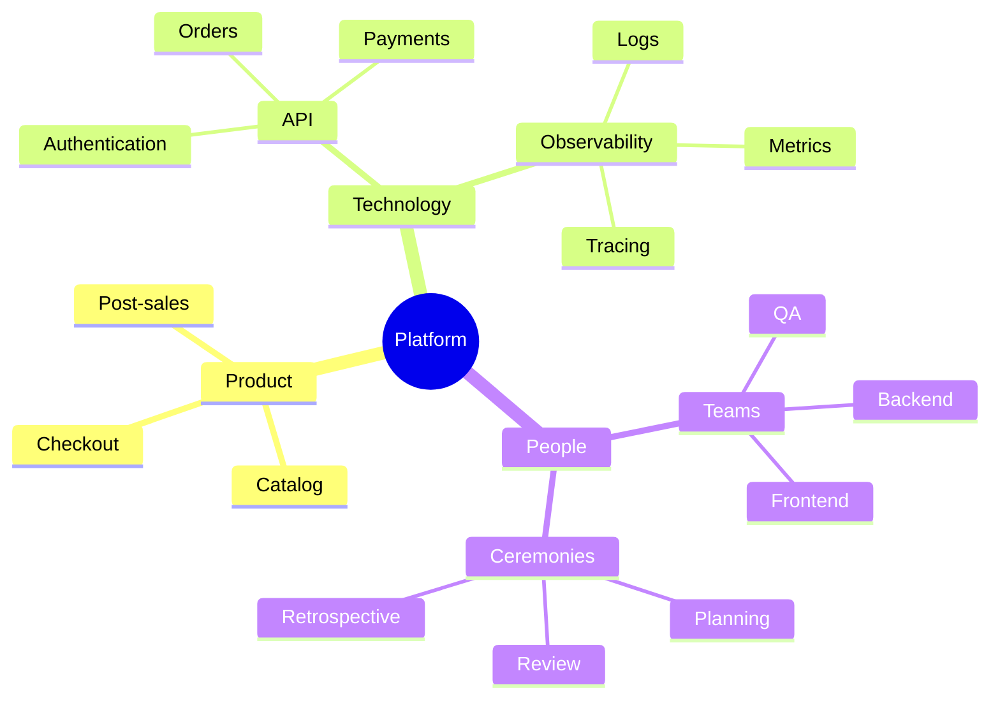
```mermaid
mindmap
  root((Platform))
    Product
      Catalog
      Checkout
      Post-sales
    Technology
      API
        Authentication
        Orders
        Payments
      Observability
        Logs
        Metrics
        Tracing
    People
      Teams
        Backend
        Frontend
        QA
      Ceremonies
        Planning
        Review
        Retrospective
```

---

## 11) Timeline — evolution by period (product history)

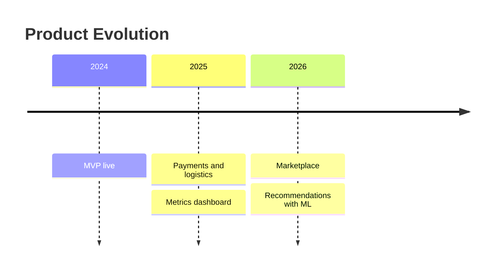
```mermaid
timeline
    title Product Evolution
    2024 : MVP live
    2025 : Payments and logistics
         : Metrics dashboard
    2026 : Marketplace
         : Recommendations with ML
```

---

## 12) Quadrant Chart — prioritization (0..1 in effort/impact)

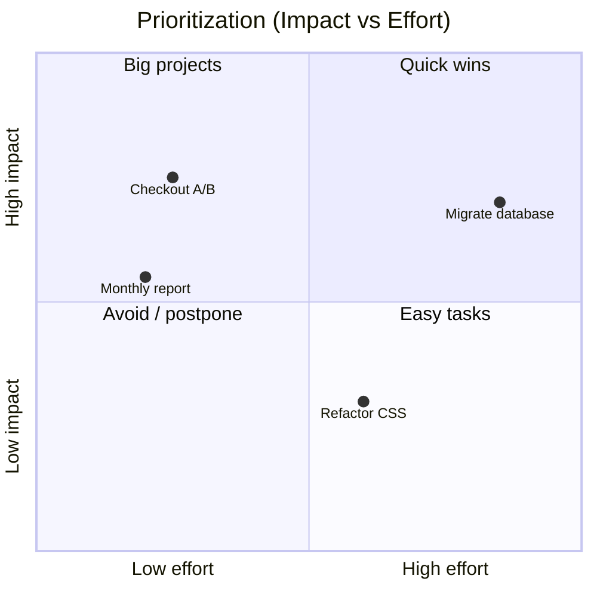
```mermaid
quadrantChart
    title Prioritization (Impact vs Effort)
    x-axis "Low effort" --> "High effort"
    y-axis "Low impact" --> "High impact"

    quadrant-1 "Quick wins"
    quadrant-2 "Big projects"
    quadrant-3 "Avoid / postpone"
    quadrant-4 "Easy tasks"

    "Checkout A/B": [0.25, 0.75]
    "Migrate database": [0.85, 0.70]
    "Refactor CSS": [0.60, 0.30]
    "Monthly report": [0.20, 0.55]
```

---

## 13) Requirement Diagram — traceability (needs → requirements → elements)

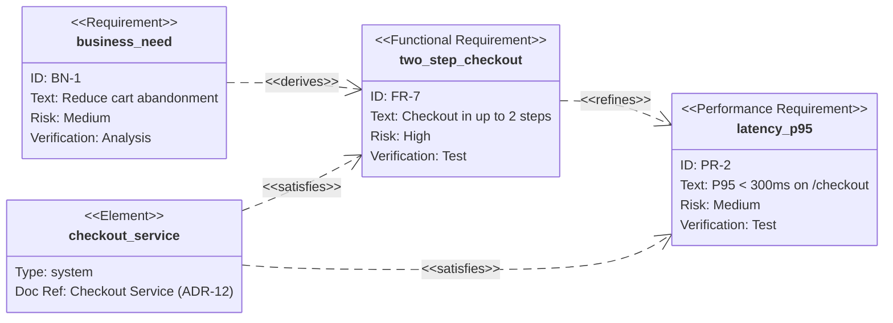
```mermaid
requirementDiagram
direction LR

requirement business_need {
    id: "BN-1"
    text: "Reduce cart abandonment"
    risk: medium
    verifymethod: analysis
}

functionalRequirement two_step_checkout {
    id: "FR-7"
    text: "Checkout in up to 2 steps"
    risk: high
    verifymethod: test
}

performanceRequirement latency_p95 {
    id: "PR-2"
    text: "P95 < 300ms on /checkout"
    risk: medium
    verifymethod: test
}

element checkout_service {
    type: system
    docref: "Checkout Service (ADR-12)"
}

business_need - derives -> two_step_checkout
two_step_checkout - refines -> latency_p95
checkout_service - satisfies -> two_step_checkout
checkout_service - satisfies -> latency_p95
```

---

## 14) C4 Context — context view (actors and external systems)

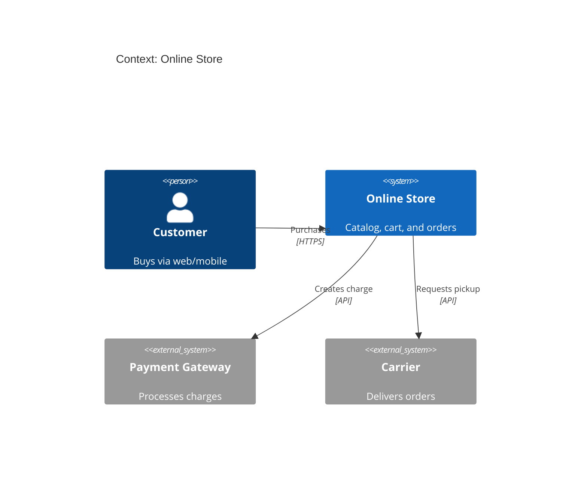
```mermaid
C4Context
    title Context: Online Store
    Person(customer, "Customer", "Buys via web/mobile")
    System(store, "Online Store", "Catalog, cart, and orders")
    System_Ext(payments, "Payment Gateway", "Processes charges")
    System_Ext(carrier, "Carrier", "Delivers orders")

    Rel(customer, store, "Purchases", "HTTPS")
    Rel(store, payments, "Creates charge", "API")
    Rel(store, carrier, "Requests pickup", "API")
```

---

## 15) C4 Container — container view (macro components + technology)

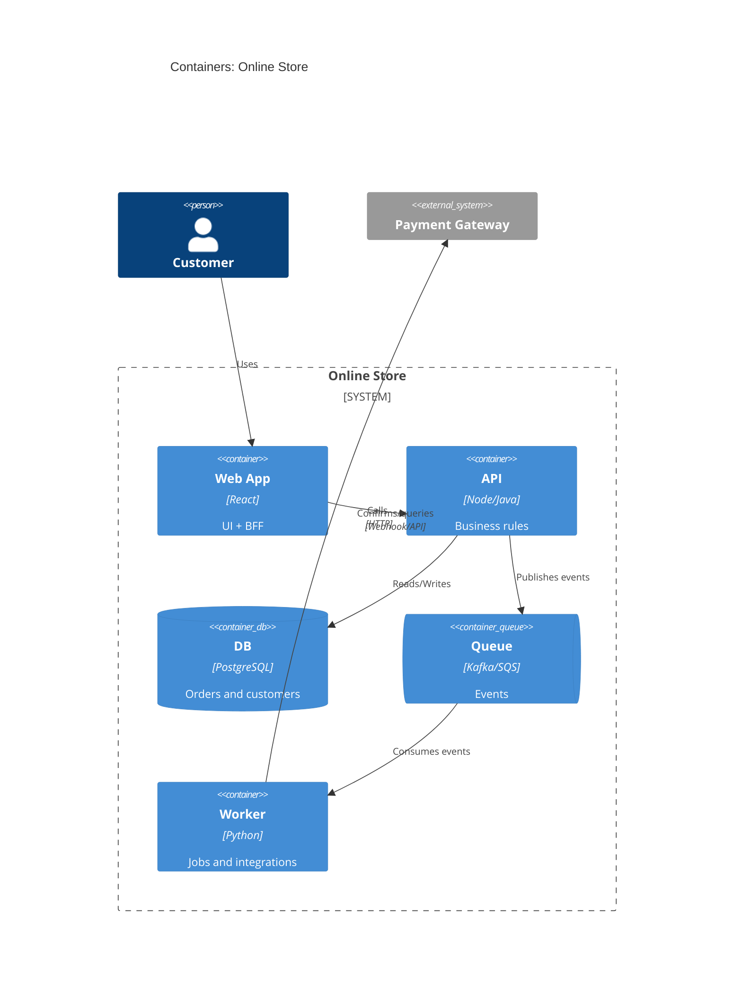
```mermaid
C4Container
    title Containers: Online Store

    Person(customer, "Customer")

    System_Boundary(store,"Online Store") {
        Container(web, "Web App", "React", "UI + BFF")
        Container(api, "API", "Node/Java", "Business rules")
        ContainerDb(db, "DB", "PostgreSQL", "Orders and customers")
        ContainerQueue(queue, "Queue", "Kafka/SQS", "Events")
        Container(worker, "Worker", "Python", "Jobs and integrations")
    }

    System_Ext(payments, "Payment Gateway")

    Rel(customer, web, "Uses")
    Rel(web, api, "Calls", "HTTP")
    Rel(api, db, "Reads/Writes")
    Rel(api, queue, "Publishes events")
    Rel(queue, worker, "Consumes events")
    Rel(worker, payments, "Confirms/queries", "Webhook/API")
```

---

## 16) Sankey — quantitative flows (CSV: source, destination, value)

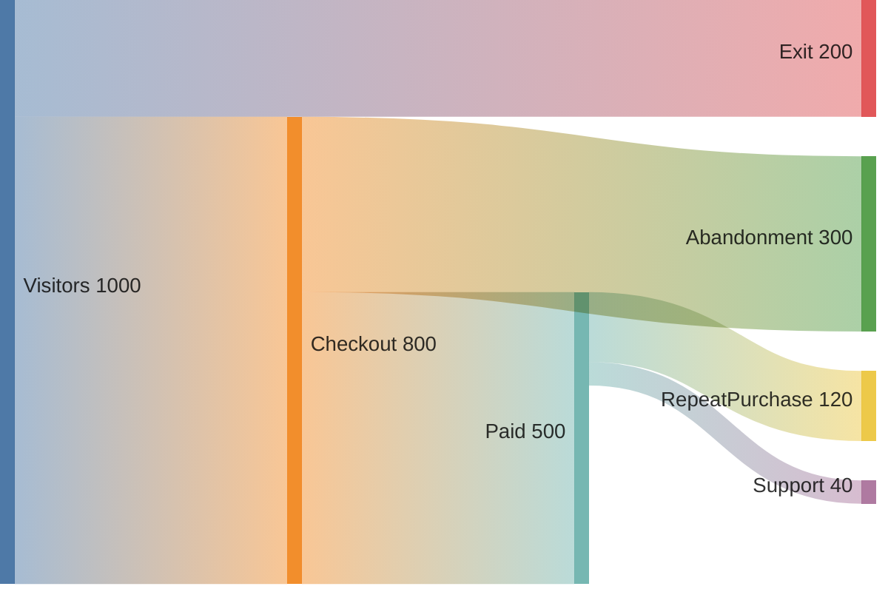
```mermaid
sankey
    Visitors,Checkout,800
    Visitors,Exit,200
    Checkout,Paid,500
    Checkout,Abandonment,300
    Paid,RepeatPurchase,120
    Paid,Support,40
```

---

## 17) XY Chart — bar + line data (same axes)

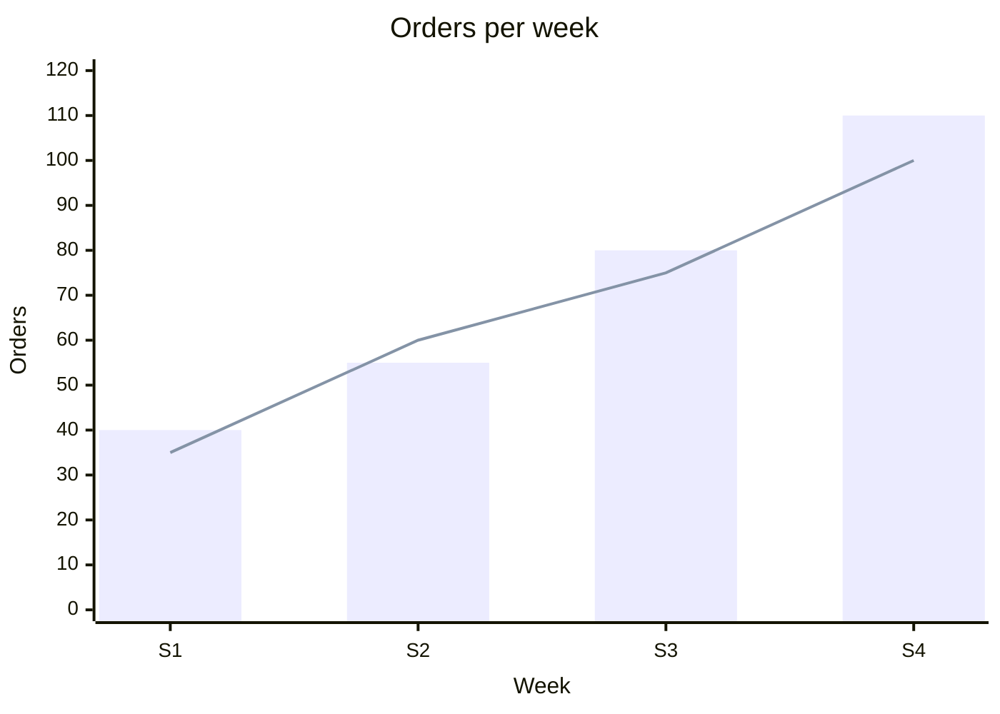
```mermaid
xychart
    title "Orders per week"
    x-axis Week [S1, S2, S3, S4]
    y-axis Orders 0 --> 120
    bar [40, 55, 80, 110]
    line [35, 60, 75, 100]
```

---

## 18) Block Diagram (block-beta) — manual layout with blocks and sub-blocks

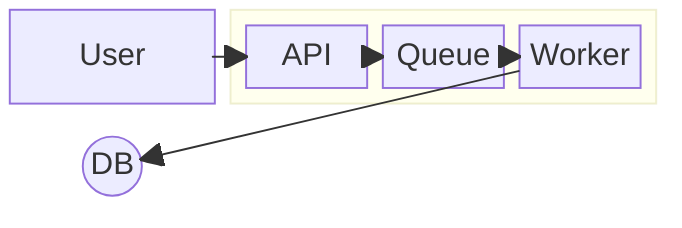
```mermaid
block-beta
    columns 3

    user["User"]
    block:plat["Platform"]:2
        api["API"]
        queue["Queue"]
        worker["Worker"]
        api --> queue
        queue --> worker
    end

    db(("DB"))

    user --> api
    worker --> db
```

---

## 19) Packet Diagram — packet structure (bits/fields)

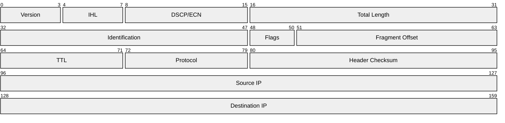
```mermaid
packet
    +4:  "Version"
    +4:  "IHL"
    +8:  "DSCP/ECN"
    +16: "Total Length"
    +16: "Identification"
    +3:  "Flags"
    +13: "Fragment Offset"
    +8:  "TTL"
    +8:  "Protocol"
    +16: "Header Checksum"
    +32: "Source IP"
    +32: "Destination IP"
```

---

## 20) Kanban — work board (sections + IDs + metadata)

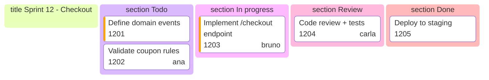
```mermaid
kanban
    title Sprint 12 - Checkout

    section Todo
        t1[Define domain events]@{ ticket: 1201, priority: 'High' }
        t2[Validate coupon rules]@{ ticket: 1202, assigned: 'ana' }

    section In progress
        t3[Implement /checkout endpoint]@{ ticket: 1203, assigned: 'bruno', priority: 'High' }

    section Review
        t4[Code review + tests]@{ ticket: 1204, assigned: 'carla' }

    section Done
        t5[Deploy to staging]@{ ticket: 1205 }
```

---

## 21) Architecture Diagram (architecture-beta) — services, groups, and side-based connections

```mermaid
architecture-beta
    group edge(internet)[Edge]
    service dns(server)[DNS] in edge
    service cdn(cloud)[CDN] in edge

    group app(cloud)[Application]
    service web(server)[Web] in app
    service api(server)[API] in app

    group data(cloud)[Data]
    service db(database)[DB] in data
    service cache(disk)[Cache] in data

    dns:R --> L:cdn
    cdn:R --> L:web
    web:R --> L:api
    api:R --> L:cache
    api:R --> L:db
```

---

## 22) Radar Chart (radar-beta) — multi-criteria comparison

```mermaid
radar-beta
    title Solution options (0-5)
    axis Performance, Cost, Reliability, UX, Security

    curve Current{2, 4, 3, 3, 2}
    curve Target{4, 3, 4, 4, 4}
```

---

## 23) Treemap (treemap-beta) — hierarchy + weight by area

```mermaid
treemap-beta
    "Costs"
        "Infrastructure": 45
        "Personnel": 35
        "Tools"
            "Monitoring": 7
            "CI/CD": 5
        "Other": 8
```

---

## 24) ZenUML (zenuml) — sequence "closer to code" (with `if` and `par`)

```mermaid
zenuml
    title Checkout (ZenUML)

    Customer
    Web
    Payments

    Customer->Web: buy()
    Web->Payments: createCharge()

    if(approved) {
        Payments->Web: ok()
        par {
            Web->Customer: showConfirmation()
            Web->Customer: sendReceipt()
        }
    } else {
        Payments->Web: error()
        Web->Customer: showFailure()
    }
```

---

## 25) System Design — multi-cloud collaborative creation platform with AI

```mermaid
graph TB
    %% Edge and protection
    clients((Web / Mobile / Plugins)) --> anycast[(Anycast DNS)] --> waf[WAF + Bot Shield]
    waf --> glb[Global LB & Geo Routing]

    %% US Region
    subgraph RegionUS[US Region - Active Active]
        subgraph US_Control[Control Plane]
            us_api[API Gateway]
            us_auth[Zero Trust Auth]
            us_flags[Feature Flag / AB]
        end
        subgraph US_Mesh[Service Mesh]
            us_ingress[Ingress]
            us_collab[Collab Service]
            us_render[Render Farm]
            us_ai[GenAI Runtime]
        end
        subgraph US_Data[Data + Streams]
            us_doc[(Doc DB)]
            us_graph[(Graph DB)]
            us_vector[(Vector Index)]
            us_bus(((Event Bus)))
            us_cache[(Edge Cache)]
        end
    end

    %% EU Region
    subgraph RegionEU[EU Region - Active Passive]
        eu_api[API Gateway]
        eu_collab[Collab Service]
        eu_vector[(Vector Index)]
        eu_bus(((Event Bus)))
        eu_cache[(Edge Cache)]
    end

    glb -->|latency / health| us_api
    glb --> eu_api
    us_api --> us_ingress --> us_collab --> us_doc
    us_collab --> us_graph
    us_collab --> us_bus
    us_render --> us_bus
    us_ai --> us_vector
    us_ai -->|fine-tuning| us_graph
    us_flags -.-> us_ingress
    us_auth --> us_api
    us_cache --> us_ingress
    us_bus -->|CDC| analytics[(Analytics Lakehouse)]
    us_bus -->|replication| eu_bus
    us_vector -->|syncs| eu_vector
    us_cache -->|warmup| eu_cache
    eu_api --> eu_collab --> eu_cache

    %% Observability
    subgraph Observability & Resilience
        tracing[Distributed Tracing]
        metrics[Metrics + SLA]
        chaos[Chaos Scheduler]
    end
    us_ingress -.-> tracing
    us_collab -.-> metrics
    us_bus -.-> metrics
    chaos -.-> us_ingress
    chaos -.-> eu_collab

    %% DR / Compliance
    subgraph Compliance
        vault[(KMS / Vault)]
        audit[(Audit Log)]
    end
    vault --> us_doc
    vault --> eu_cache
    audit -.-> metrics