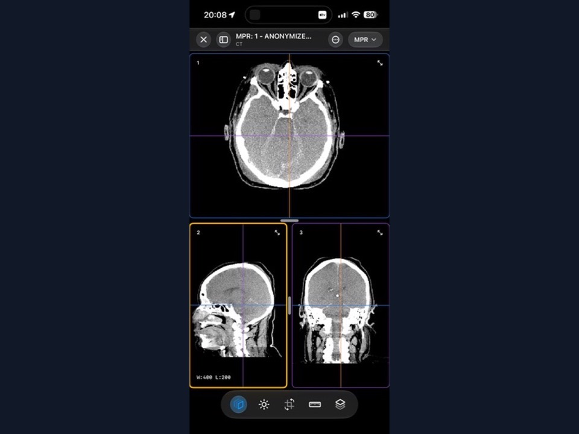
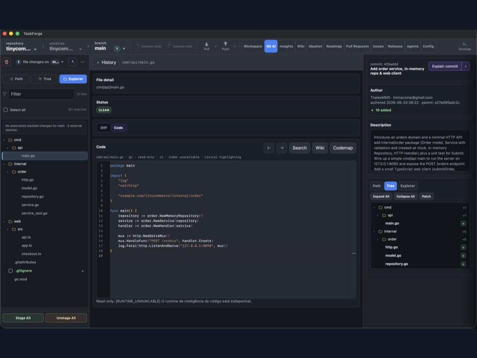
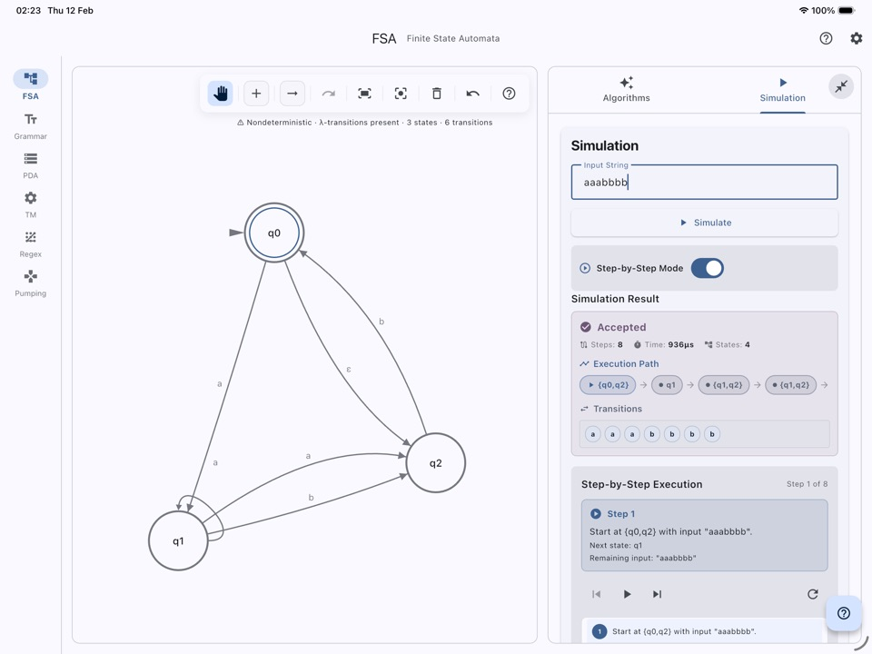
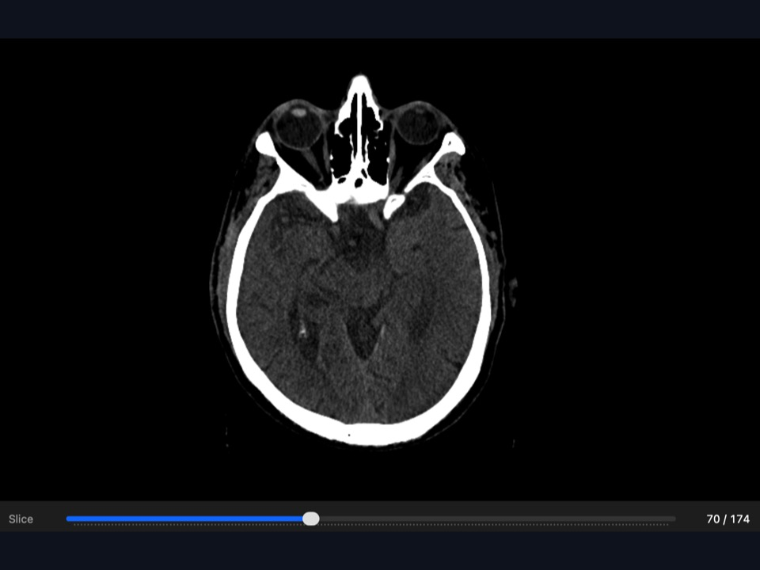
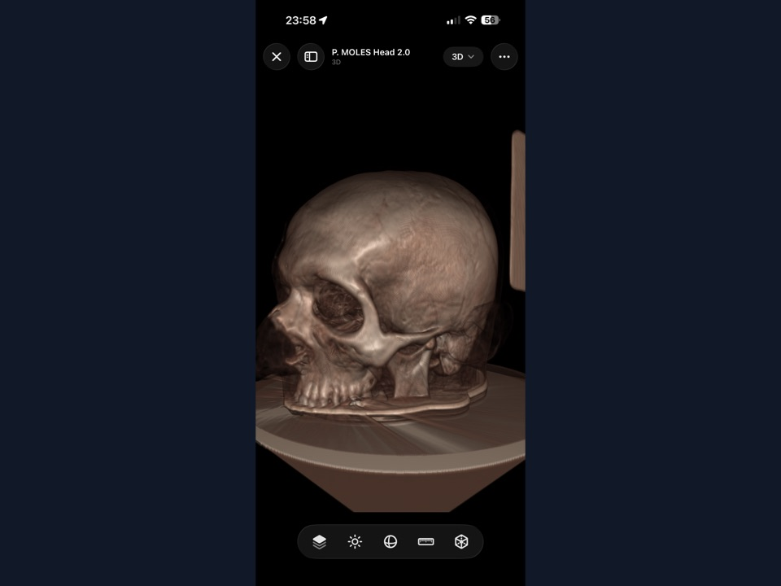
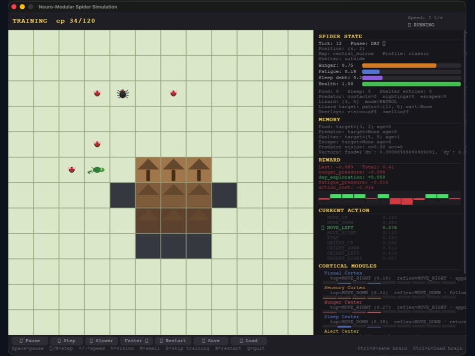
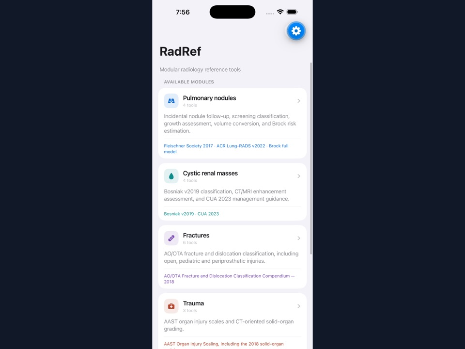
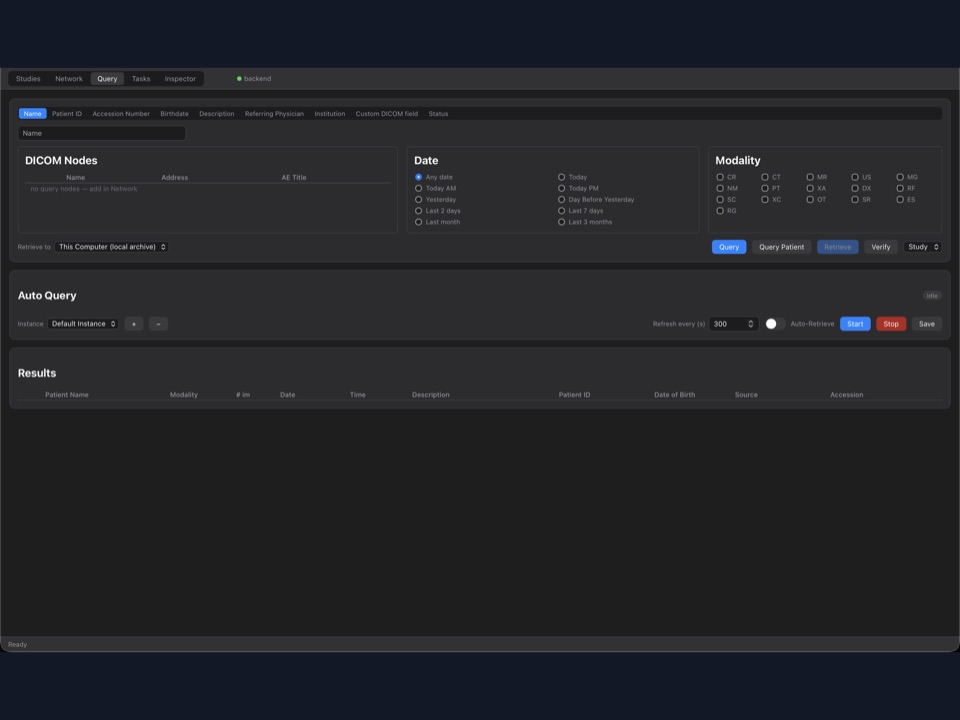
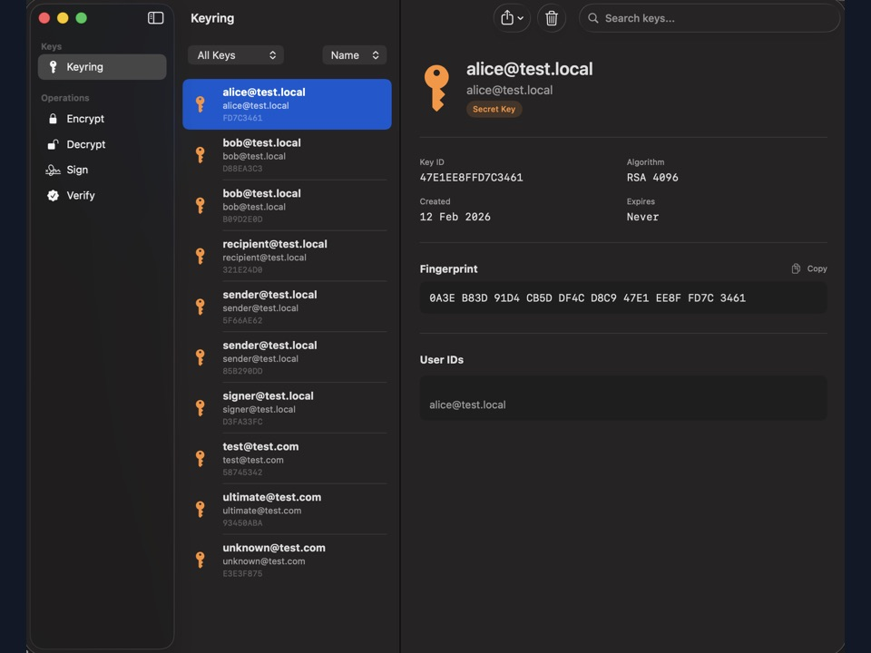
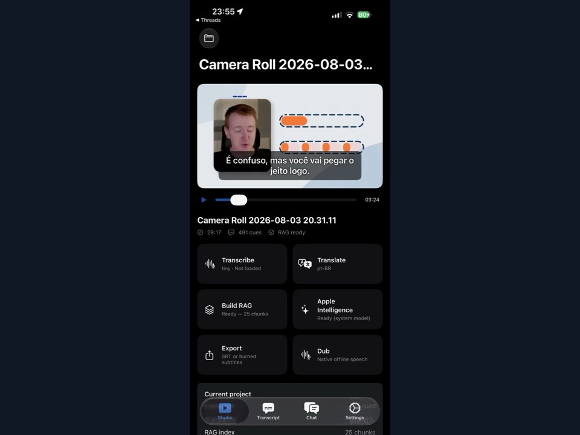

# Thales Matheus M. Santos

**Physician · Radiologist · Computer Science undergraduate**

---

## About Me

I'm a physician and computer science undergraduate exploring how software engineering and artificial intelligence can advance radiological practice. My radiology experience is hospital-based diagnostic imaging, including emergency/trauma and oncologic care. I have hands-on contributions to DICOM viewers, PACS infrastructure, and exploratory AI tooling for healthcare and medical imaging, and I'm comfortable moving from clinical questions to code and back.

**Main interests:**

- Local-first imaging platforms and DICOM viewers (2D/MPR/volumetric rendering, DIMSE/DICOMweb)
- Generative AI in medicine and AI-assisted radiological decision-making (LLMs/agents, local inference, RAG/finetuning)
- Infrastructure for healthcare systems (PACS, NAS, EHR, and other systems)
- AI-assisted software engineering and developer tooling
- Full-stack development tailored to clinical workflows

---

## Featured Projects

<table>
  <tr>
    <td width="50%" valign="top" align="center">
      
       
      <b>Isis DICOM Viewer</b>
       
      Cross-platform DICOM viewer family — for all Apple devices, Windows and Android
        
    </td>
    <td width="50%" valign="top" align="center">
      
       
      <b>TaskForge</b>
       
      AI-assisted project planning and task workflows grounded in your codebase.
        
    </td>
  </tr>
  <tr>
    <td width="50%" valign="top" align="center">
      
       
      <a href="https://github.com/ThalesMMS/JFlutter"><b>JFlutter</b></a>
       
      Touch-first Flutter reimplementation of JFLAP — automata, grammars, pushdown automata, Turing machines, and regexes on mobile, desktop, and web.
        
    </td>
    <td width="50%" valign="top" align="center">
      
       
      <a href="https://github.com/ThalesMMS/DICOM-Swift"><b>DICOM-Swift</b></a>
       
      Pure Swift DICOM decoder toolkit for iOS/macOS — metadata and pixel parsing, window/level and export pipelines, SwiftUI viewer components, and CLI tools.
        
    </td>
  </tr>
  <tr>
    <td width="50%" valign="top" align="center">
      
       
      <a href="https://github.com/ThalesMMS/MTK"><b>MTK — Metal Toolkit</b></a>
       
      Swift Package for Metal-native medical volume rendering — GPU-resident volume, MPR, projections, transfer functions, and reusable SwiftUI clinical viewports.
        
    </td>
    <td width="50%" valign="top" align="center">
      
       
      <a href="https://github.com/ThalesMMS/BIONG"><b>BIONG</b></a>
       
      Biologically Inspired Organism, Not a Game — a simulator where modular cortical networks drive survival behavior.
        
    </td>
  </tr>
  <tr>
    <td width="50%" valign="top" align="center">
      
       
      <a href="https://github.com/ThalesMMS/RadRef"><b>RadRef</b></a>
       
      Modular radiology reference app — Fleischner 2017, Lung-RADS v2022, Brock/PanCan, Bosniak v2019, AO/OTA fractures, and AAST trauma scales.
        
    </td>
    <td width="50%" valign="top" align="center">
      
       
      <a href="https://github.com/ThalesMMS/Go-PACS"><b>Go-PACS</b></a>
       
      Native Go/Fyne PACS desktop app built on dicom-go — archive import, remote node management, C-ECHO/C-FIND/C-MOVE/C-STORE, and a built-in receiver.
        
    </td>
  </tr>
  <tr>
    <td width="50%" valign="top" align="center">
      
       
      <a href="https://github.com/ThalesMMS/MacPGP-app"><b>MacPGP</b></a>
       
      OpenPGP for macOS — key management, file/message encryption, signing, Keychain passphrase storage, and Finder/Quick Look extensions.
        
    </td>
    <td width="50%" valign="top" align="center">
      
       
      <b>Video Subtitler</b>
       
      Local video dubbing app: Whisper transcription, LLM translation, and synced Piper TTS remuxed into the video.
        
    </td>
  </tr>
</table>

---

## Other Projects

### Medical Imaging & Radiology

- [**dicom-plugin**](https://github.com/ThalesMMS/dicom-plugin) · [**dicom-skill**](https://github.com/ThalesMMS/dicom-skill) · [**dicom-viewer-mcp-app**](https://github.com/ThalesMMS/dicom-viewer-mcp-app) — Integrated DICOM toolkit that turns AI agents and chat clients into imaging workstations: MCP-based DIMSE/DICOMweb query/retrieve, safe sending, anonymization, transcoding, PDF/PNG/MP4 export, and an interactive in-chat viewer.
- [**dicom-go**](https://github.com/ThalesMMS/dicom-go) — Pure Go DICOM module: read/write, DICOM JSON conversion, pixel data extraction, dictionaries and transfer syntaxes, and minimal C-ECHO/C-STORE workflows.
- [**rusty-dicom-node**](https://github.com/ThalesMMS/rusty-dicom-node) — Terminal-first Rust DICOM node client built on dicom-rs: remote node configuration, C-FIND/C-MOVE/C-STORE workflows, SQLite local indexing, recursive/ZIP import, and a ratatui TUI.
- **PACS-Natural-Language-Query** — CLI toolkit that translates natural language or SQL into validated DICOM C-FIND queries, with dry-run/explain output, result streaming, and PHI-aware logging.
- [**Dicom-Tools**](https://github.com/ThalesMMS/Dicom-Tools) — Multi-language DICOM workbench comparing DCMTK, GDCM, ITK/VTK, dicom-rs, fo-dicom, dcm4che, Cornerstone3D, pydicom/pynetdicom, and related backends through a shared UI.
- [**dicompressor**](https://github.com/ThalesMMS/dicompressor) — Native C++20 batch DICOM transcoder for HTJ2K/JPEG 2000 lossless workflows, built with DCMTK and OpenJPH.
- [**TotalSegmentator OsiriX/Horos Plugin**](https://github.com/ThalesMMS/TotalSegmentator-OsiriX-Horos-Plugin) — Runs TotalSegmentator on the active CT/MR series in an isolated Python environment and imports RT-Struct overlays back into the host viewer.
- [**OsiriX-Backup-Plugin**](https://github.com/ThalesMMS/OsiriX-Backup-Plugin) — Sends DICOM studies to remote PACS/storage targets with queueing, retry, SHA-256 integrity manifests, and duplicate avoidance.
- [**orthanc-tools**](https://github.com/ThalesMMS/orthanc-tools) — Python operations toolkit for Orthanc: Docker/Ubuntu deployment, REST health checks, remote sync, PACS mirroring, backfill, and backup workflows.
- **Orthanc for QNAP** — Custom `.qpkg` packaging of the Orthanc server for QNAP NAS devices.
- [**Radiology-Templates**](https://github.com/ThalesMMS/Radiology-Templates) — Radiology report templates with Python/Rust tools for DOCX/Markdown/TXT round trips, formatting rules, and index generation.
- [**mammography-pipelines-py**](https://github.com/ThalesMMS/mammography-pipelines-py) — Research package and CLI for breast-density experiments: preprocessing, feature engineering, reproducible reporting, and model training.
- [**brain-mri-pipelines-py**](https://github.com/ThalesMMS/brain-mri-pipelines-py) — Alzheimer's MRI research framework: multi-view MRI + clinical-feature fusion, EfficientNet/DenseNet/MedicalNet backbones, and subject-level split safeguards.

### AI & Machine Learning

- [**AutoComp**](https://github.com/ThalesMMS/AutoComp) — macOS menu bar autocomplete that watches accessible text fields and shows inline suggestions, backed by OpenAI-compatible endpoints, Apple Intelligence, or local llama.cpp.
- [**ReadMyPaper-go**](https://github.com/ThalesMMS/ReadMyPaper-go) — Local app that converts scientific PDFs into listenable audio: Docling layout extraction, reading-order repair, optional LLM cleanup, notation verbalization, and Piper/Kokoro TTS.
- [**reports-to-llm**](https://github.com/ThalesMMS/reports-to-llm) — Rust preprocessing tool that normalizes DOCX/RTF medical reports into clean, structured UTF-8 text for LLM/RAG research.
- [**Rust-Neural-Networks**](https://github.com/ThalesMMS/Rust-Neural-Networks) · [**Swift-Neural-Networks**](https://github.com/ThalesMMS/Swift-Neural-Networks) — Educational from-scratch neural networks: MNIST, CIFAR-10, XOR, manual backprop, CNN/MLP/self-attention, plus MLX-based Swift workflows.
- [**hermes-local-patchkeeper**](https://github.com/ThalesMMS/hermes-local-patchkeeper) — Hermes Agent skills for auditing, capturing, and safely reapplying intentional local customizations after updates.

### Tools & Utilities

- [**PGP-Client-go**](https://github.com/ThalesMMS/PGP-Client-go) — OpenPGP client in Go: key generation/import/export, file and message encryption, signing, and signature verification.
- [**Code-Scanner**](https://github.com/ThalesMMS/Code-Scanner) — Rust CLI (with Bash fallback) that bundles a repository into a single text report for audits, code review, and LLM prompts.
- [**GitHub-Replicant**](https://github.com/ThalesMMS/GitHub-Replicant-rs) — Async Rust CLI for bulk GitHub backup and sync of owned, starred, watched, and discovered repositories.
- [**jff-to-tex Turing Machine Diagram Converter**](https://github.com/ThalesMMS/jff-to-tex-Turing-Machine-Diagram-Converter) — Python converter that turns JFLAP `.jff` Turing machine diagrams into LaTeX/TikZ.
- [**LaTeX-Paper-Template**](https://github.com/ThalesMMS/LaTeX-Paper-Template) — SBC-based LaTeX skeleton for papers, monographs, and theses, with centralized metadata and release checklist.
- [**BTC-21M-Countdown**](https://thalesmms.github.io/BTC-21M-Countdown) — Live Bitcoin supply countdown to the 21 Million milestone.

---

  

